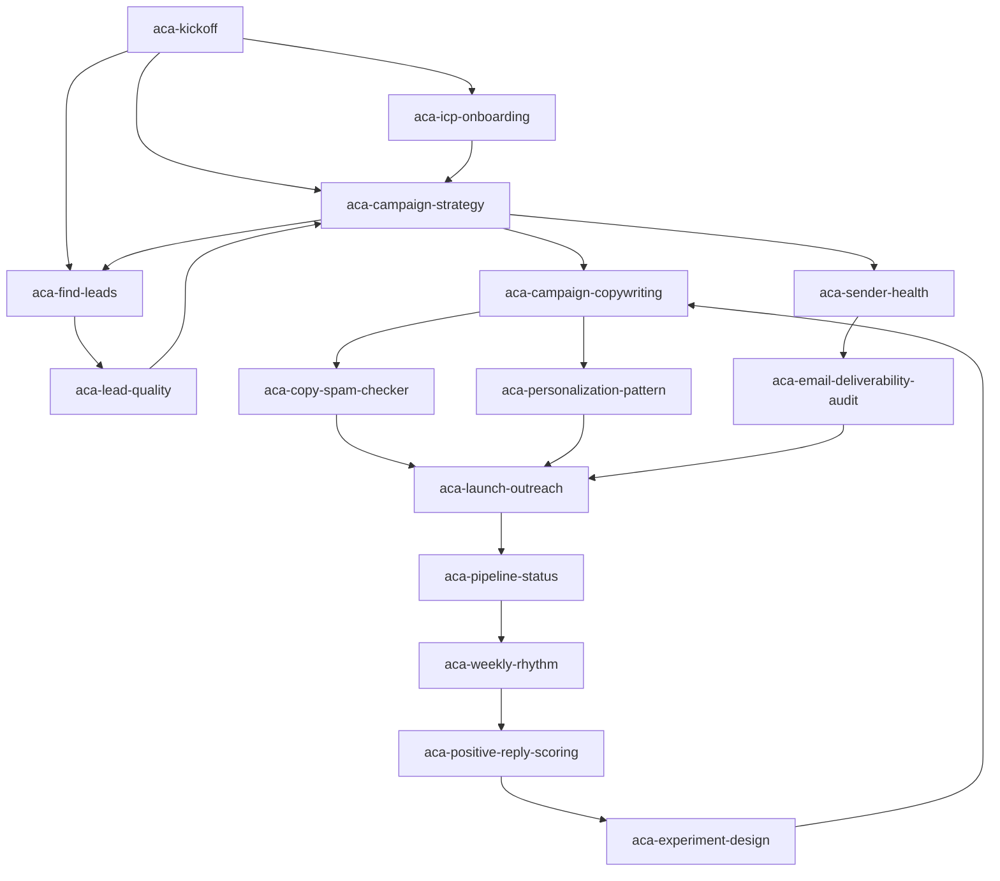
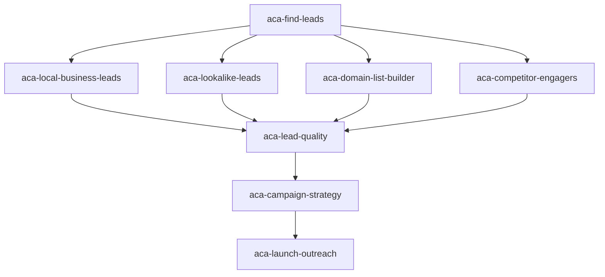
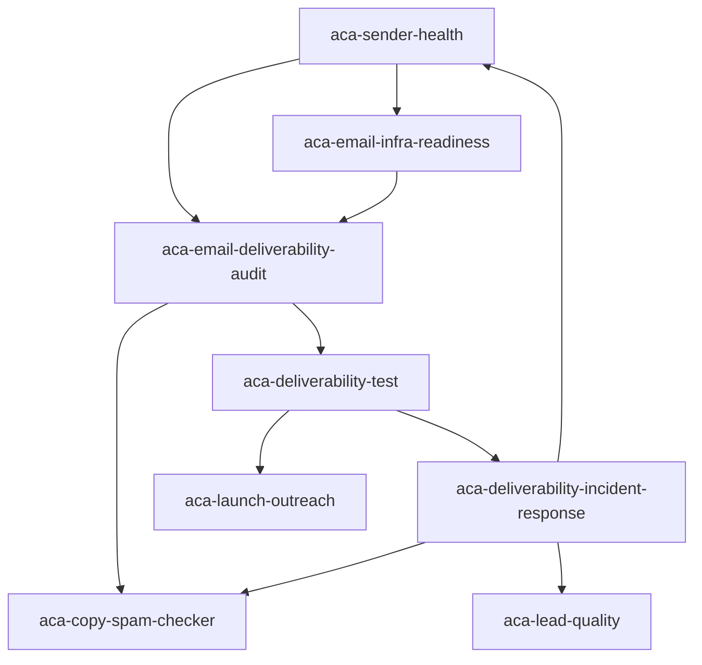
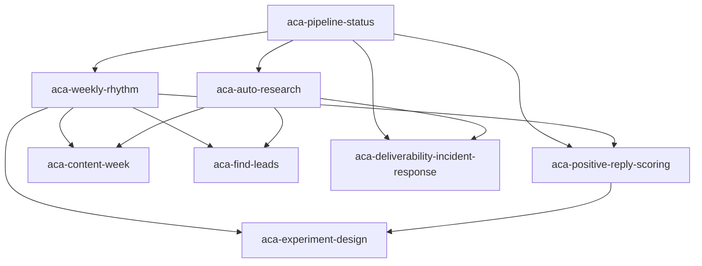

# ACA Skill Chaining

The skills in this repo are designed to operate as a chain, not as isolated prompts.

Each `SKILL.md` includes a `Skill chaining` section with:

- Upstream skills that commonly call it
- Auto-continue conditions
- Stop-before-chaining conditions
- Downstream skills
- A handoff block to preserve context

## Chain Contract

When a skill finishes a step and another ACA skill is needed:

1. Preserve the selected ACA organization.
2. Carry forward relevant IDs: product, ICP, lead list, campaign, sequence, generation job, sender account, and strategy document.
3. Preserve approval state. Do not silently turn a draft into a live campaign unless the user already approved that action.
4. Continue automatically only when the user asked for execution and the next step does not require new approval.
5. If approval is needed, stop with a handoff block.

Every skill should end complex work with:

```text
Chain state: {continue|needs_approval|blocked|complete}
Next skill: {aca-skill-name|none}
Reason: {why this handoff is or is not needed}
Carry forward: {org_id/name, product_id, icp_id, lead_list_id, campaign_id, sequence_id, job_id, approvals, constraints}
```

## Primary Chain



## Audience Chain



## Deliverability Chain



## Operating Chain


